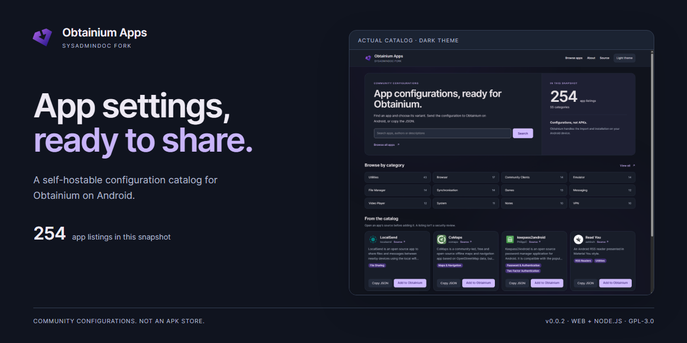
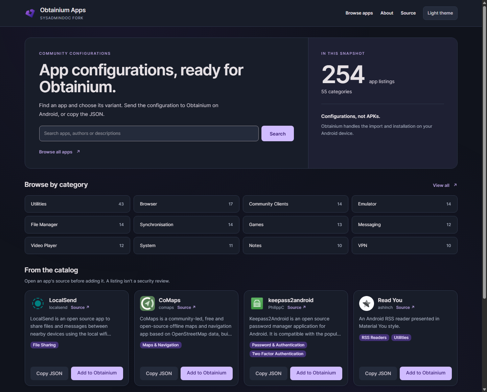
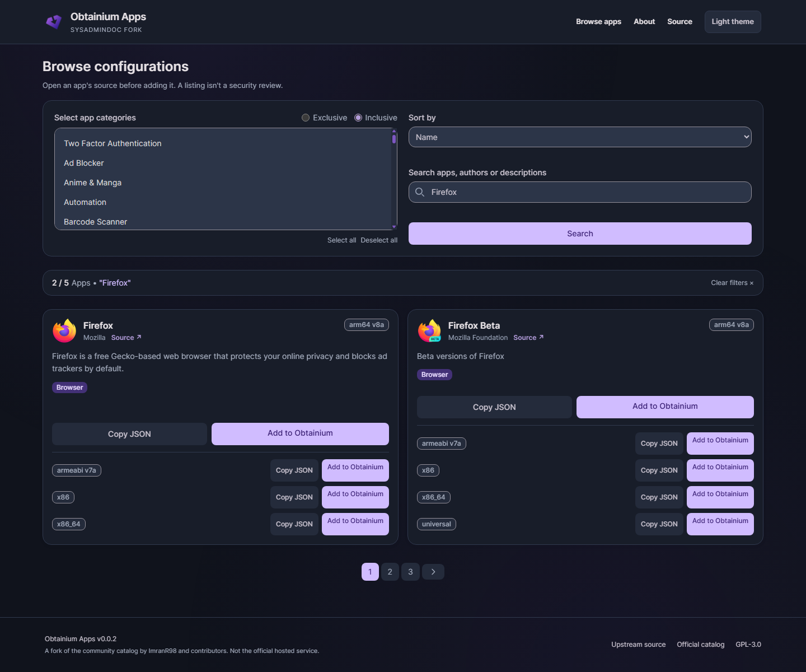
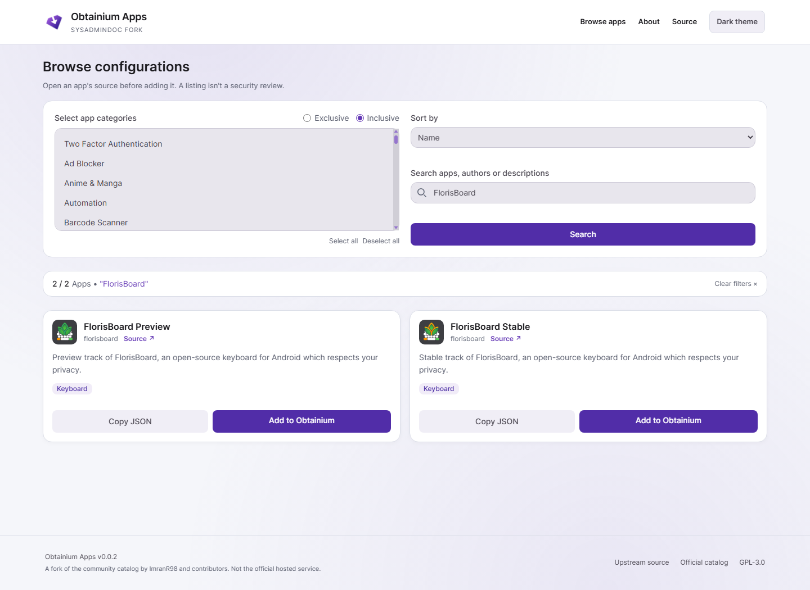
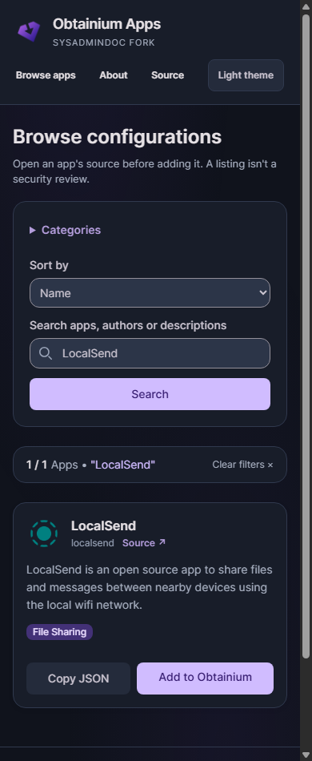

# Obtainium Apps

[](https://github.com/SysAdminDoc/apps.obtainium.imranr.dev/releases/latest) [](LICENSE) 

**Find an app's configuration. Hand it to Obtainium.**

Search 254 community-supplied app listings, choose a variant, and share its settings with [Obtainium for Android](https://obtainium.imranr.dev/). You can copy the JSON instead. This is a configuration catalog, not an APK store or the Android app itself.

This repository is **SysAdminDoc's fork** of [ImranR98's community catalog](https://github.com/ImranR98/apps.obtainium.imranr.dev). The [official hosted catalog](https://apps.obtainium.imranr.dev/) is maintained upstream and may contain different data.

[Download this fork](https://github.com/SysAdminDoc/apps.obtainium.imranr.dev/releases/latest) · [Run it locally](#run-it-locally) · [Self-hosting guide](docs/SELF_HOSTING.md) · [Contribute a configuration](CONTRIBUTING.md)



## What you can do

- Find an app by name, author or description. Filter by any selected category, or require a match in every selected category.
- Check the source link and choose the right configuration variant.
- **Add to Obtainium** opens a configuration link on Android. **Copy JSON** keeps the settings available for another workflow.
- Host your own catalog from the included source. The website has no advertising, analytics scripts or remote fonts.

The release contains **254 listings, 378 configurations and 55 categories**. Several variants can belong to one app. This is a snapshot of the inherited catalog, with two hidden records restored here. It does not automatically track changes to the official service.

### See the source before adding an app



A listing isn't a security review. Check the publisher and release source before importing anything. Download availability and app requirements can change.

Obtainium must already be installed on Android to handle its links. It controls the import and any subsequent APK installation. Clicking a catalog link does not silently install an app. See [Obtainium's deep-link guide](https://wiki.obtainium.imranr.dev/deep_links/) for that behavior.

### Choose a variant



The website also works on narrow screens. Dark is the default, with a saved light-theme option. Missing translations fall back to English.

<details>
<summary>Mobile catalog screenshot</summary>



</details>

## Run it locally

Install **Node.js 22.12 or newer**, then run these commands from the repository folder:

```sh
npm ci
npm run dev
```

Open [127.0.0.1:8080](http://127.0.0.1:8080). The development server stays on your own machine by default.

For a production build:

```sh
npm test
npm run typecheck
npm run build
npm start
```

The [latest release](https://github.com/SysAdminDoc/apps.obtainium.imranr.dev/releases/latest) includes a complete source ZIP and a prebuilt Node server ZIP. The server ZIP still needs Node.js and `npm ci --omit=dev` before `npm start`. Checksums accompany the downloads. It is not a standalone desktop executable.

Read the [self-hosting guide](docs/SELF_HOSTING.md) for HTTPS deployment, environment settings and the JSON API.

## Data and privacy

The app reads configurations from `public/data/apps/`. No account or database is required. Icon images come from the third-party URLs supplied with each listing; those hosts receive image requests and the visitor's IP address. The website sends no referrer with those images.

Optional statistics require an endpoint and site ID you supply at build time. They represent **link clicks, not installations**. They're off by default.

Run `npm run validate` to check the local catalog without contacting app sources or modifying records. Broken icon URLs have a visible fallback; don't remove an app just because its icon host is temporarily unavailable.

## Contributing and provenance

See [CONTRIBUTING.md](CONTRIBUTING.md) and the [app criteria](APP_CRITERIA.md). This fork keeps upstream's Obtainium icon and contributor credit. It doesn't claim to be the official Obtainium service.

The [concept archive](assets/concepts/2026-09-09-marketing/README.md) keeps the original icon, all 299 original source files and the actual before/after review captures. Only reviewed screenshots are used above.

Local release checks cover the website, configuration exports and packaged server. **Android-side import, APK installation and a hosted deployment have not been verified for this release.** Listed apps have not received a new security review.

Licensed under [GNU GPL v3](LICENSE), as inherited from upstream. The original [LICENSE.md](LICENSE.md) is retained.
